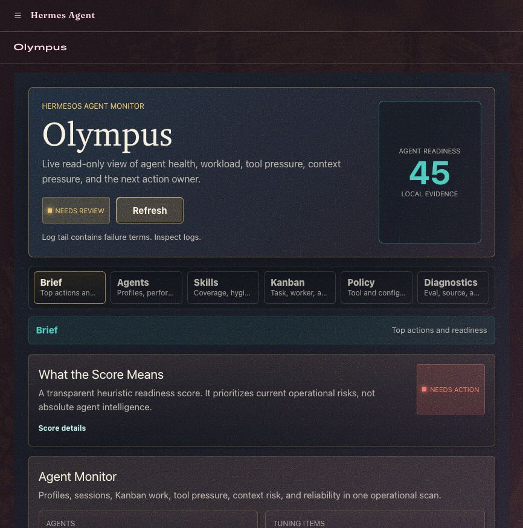

# Olympus

Olympus is a read-only [HermesOS](https://github.com/NousResearch/hermes-agent) Agent Monitor for operational tuning.

It reads local Hermes runtime state and shows what to tune next across profiles,
routes, skills, sessions, cron, gateways, Kanban work, and runtime health. It
does not run agents and does not replace Hermes admin pages. It explains how the
agent system is performing and links to the Hermes page that owns each fix.

See [`OLYMPUS_GOAL.md`](OLYMPUS_GOAL.md) for the product boundary (what Olympus
owns vs. what Hermes owns).



## What It Does

- Ranks agent optimization items with the evidence behind each one.
- Compares profile readiness, route metadata, skill coverage, gateway state, and workload.
- Summarizes Kanban pressure: blocked work, active workers, retries, and assignee load.
- Surfaces safe config policy risks: turn limits, loop guardrails, browser privacy flags, fallbacks, toolsets, and auxiliary cost visibility.
- Computes a transparent heuristic readiness score with a full deduction breakdown.
- Opens with a Brief view for the next action, then stages deeper panels behind Agents, Skills, Kanban, Policy, and Diagnostics tabs.
- Keeps v1 read-only: every action is a link to the Hermes page that owns it.

## What It Does Not Do

- Create or move Kanban tasks, or spawn workers.
- Edit profiles, cron, gateways, routes, memory, MCP, keys, or config.
- Rebuild Hermes Usage/Analytics for token, model, session, or spend totals.
- Show secrets, or expose local labels/paths unless explicitly enabled.

## Requirements

- A working [HermesOS / Hermes Agent](https://github.com/NousResearch/hermes-agent) install (`$HERMES_HOME`, default `~/.hermes`).
- Python 3.10+ (the backend is a FastAPI router loaded by Hermes).
- Node.js/npm for verification and Playwright-based visual smoke tests. There is
  no frontend build step; `dashboard/dist/*` is hand-authored SDK React/CSS.

## Install In A Local Hermes Dashboard

Install Olympus from source, link it into your local Hermes home, and start the
Hermes dashboard:

```bash
git clone https://github.com/AIEngineerX/Olympus.git
cd Olympus
npm ci
npm run dev
```

`npm run dev` links this repository's `dashboard/` folder into:

```text
$HERMES_HOME/plugins/olympus/dashboard/
```

Then it starts Hermes with:

```bash
scripts/install-dashboard-link.sh
hermes dashboard --no-open --skip-build
```

Then open:

```text
http://127.0.0.1:9119/olympus
```

After the tab loads, follow [`after-install.md`](after-install.md) to confirm
the first screen, privacy defaults, and local smoke checks.

## Dashboard Modes

Olympus opens in Brief mode: hero status, score details, and Agent Monitor.
Deeper inspection is split into purpose-built tabs:

- Agents: Performance Tracking, Profile Fitness, and Pantheon.
- Skills: Skill Coverage and Skill Hygiene.
- Kanban: Trace Spine and Kanban Intelligence.
- Policy: Tool Policy & Aux Cost.
- Diagnostics: Operational Evals, Production Diagnostics, and Evidence Sources.

## Hermes Desktop

Hermes Desktop owns chat, agents, profiles, skills, sessions, cron, settings,
and Command Center Usage. Olympus is the read-only operations monitor beside
those controls. It should show risk and evidence, then link to the Hermes page
that owns the fix.

Today Olympus is verified through the Hermes web dashboard at `/olympus`.
Desktop visibility requires Hermes Desktop plugin-tab parity for dashboard
plugins. See
[`dashboard/docs/HERMES_DESKTOP_INTEGRATION.md`](dashboard/docs/HERMES_DESKTOP_INTEGRATION.md).

Run `npm run test:desktop` to verify the local Desktop app, Command Center
Usage ownership, web dashboard plugin support, and the current plugin-tab parity
status before preparing an upstream Desktop PR.

## API

Hermes mounts Olympus at `/api/plugins/olympus/`:

| Route | Purpose |
| --- | --- |
| `GET /health` | Liveness and a coarse runtime status summary |
| `GET /overview` | Full dashboard read model: health, tuning, profiles, gateways, cron, sessions, Kanban, performance, Trace Spine, Operational Evals, skill hygiene, config policy, and evidence sources |
| `GET /tuning` | Tuning-focused read model with score breakdown, Kanban intelligence, Trace Spine, Operational Evals, skill hygiene, config policy, performance, and evidence sources |

Routes sit behind the Hermes dashboard session-token middleware. The frontend
calls them through the plugin SDK's `fetchJSON`, which injects the token.

## Privacy

Olympus hides session titles, Kanban task titles, cron names, exact route labels,
and local paths by default. To show richer local labels on a private machine:

```bash
OLYMPUS_EXPOSE_LOCAL_LABELS=1 hermes dashboard --no-open --skip-build
```

See [`SECURITY.md`](SECURITY.md) for the full security and privacy posture.

## Project Layout

```text
.
├── dashboard/
│   ├── manifest.json            # plugin metadata, tab path, assets, api module
│   ├── plugin_api.py            # FastAPI router (read-only backend)
│   ├── dist/index.js            # hand-authored SDK React frontend
│   ├── dist/style.css           # olympus-* styles
│   ├── docs/BUILD_PLAN.md       # implementation plan
│   ├── docs/HERMES_DESKTOP_INTEGRATION.md
│   ├── docs/PRODUCTION_READINESS.md
│   ├── docs/VIEWPORT_STRATEGY.md
│   ├── docs/FRONTEND_SKILL_RESEARCH.md
│   └── README.md                # package notes
├── docs/assets/olympus-dashboard.jpg
├── scripts/install-dashboard-link.sh
├── scripts/olympus-live-smoke.mjs
├── scripts/olympus-performance-smoke.mjs
├── tests/visual/                 # Playwright fixture checks
├── tests/fixtures/                # Olympus browser fixtures
├── package.json                   # verification scripts
├── after-install.md              # post-install checks
├── OLYMPUS_GOAL.md              # product boundary
├── TODO.md                      # active backlog
├── SECURITY.md                  # security and privacy notes
├── CONTRIBUTING.md              # development and contribution guide
├── LICENSE                      # MIT
└── README.md
```

Note: `dashboard/dist/*` is hand-authored SDK React/CSS. There is no bundler or
build step. See [`CONTRIBUTING.md`](CONTRIBUTING.md) for the development workflow.

## Verify

```bash
npm run verify
npm run test:visual
npm run test:live
npm run test:performance
npm run test:security
npm run test:desktop
npm audit --audit-level=moderate
```

`npm run test:visual` uses a fixture-backed Playwright harness. It loads the
hand-authored dashboard assets directly, checks desktop/mobile readability across
multiple fixture states, validates link destinations, verifies empty evidence
sections stay hidden, verifies staged dashboard modes, and catches private-label
leaks in the no-labels scenario.

`npm run test:live` checks the real Hermes dashboard route at
`http://127.0.0.1:9119/olympus`. It starts Hermes when needed, verifies
desktop/mobile rendering, clicks each dashboard mode, and fails on console
errors, overflow, tiny labels, bad links, SVG text, or missing staged panels.

`npm run test:performance` checks the real `/overview` and `/tuning` plugin API
routes through the Hermes session-token flow. It fails on non-2xx responses,
slow local response time, backend diagnostic budget warnings, or payloads above
the documented budget.

The live smoke runner reuses an existing Hermes dashboard only when the served
HTML includes the Hermes session token. If it needs to start Hermes and your
`$HERMES_HOME/plugins/olympus/dashboard` target already points somewhere else,
set `OLYMPUS_SMOKE_RELINK=1` before running the smoke command.

## Quality Gates

- API responses redact session IDs, private labels, paths, and secrets unless
  `OLYMPUS_EXPOSE_LOCAL_LABELS=1` is explicitly set.
- Brief mode hides deep panels by default; visual and live smoke tests click the
  tabs that own Agents, Skills, Kanban, Policy, and Diagnostics.
- Pantheon uses HTML text and accessible profile buttons rather than SVG text or an
  image-role wrapper.
- Frontend refreshes ignore stale `/overview` responses so an older request
  cannot overwrite newer data.
- Attention items are sorted by severity before truncation.
- Gateway configuration detection parses `.env` variable names only; values are
  not scanned or returned.
- Config policy reads only safe structure, counts, and flags; it does not return
  prompt text, base URLs, API keys, env values, or local paths.
- Dependencies are exact-pinned in `package.json`, locked in
  `package-lock.json`, and checked with `npm audit --audit-level=moderate`.

## Contributing

Contributions are welcome. Please read [`CONTRIBUTING.md`](CONTRIBUTING.md)
first. It covers the local dev loop, the read-only and privacy rules, the
verification commands, and commit/PR conventions.

## Security

Found a security or privacy issue? See [`SECURITY.md`](SECURITY.md) for the
posture and how to report.

## References

- [HermesOS / Hermes Agent](https://github.com/NousResearch/hermes-agent)
- [HermesOS documentation](https://hermes-agent.nousresearch.com/docs)
- [`dashboard/docs/PRODUCTION_READINESS.md`](dashboard/docs/PRODUCTION_READINESS.md)
- [`dashboard/docs/VIEWPORT_STRATEGY.md`](dashboard/docs/VIEWPORT_STRATEGY.md)

## License

[MIT](LICENSE), AIEngineerX.
